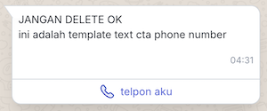

# WhatsApp Outbound Message Direct API

⚠️ **Security Notice**: 
- Never commit sensitive credentials to version control
- Use environment variables for secrets
- Keep your API keys secure
- Regularly rotate your credentials

## Table of Contents
1. [Prerequisites](#prerequisites)
2. [Quick Start](#quick-start)
3. [API Information](#api-information)
4. [Flow](#flow)
5. [Authentication](#authentication)
6. [Get available WhatsApp channels](#get-available-whatsapp-channels)
7. [Get available WhatsApp message template](#get-available-whatsapp-message-template)
8. [Send Whatsapp Message Outbound Direct](#send-whatsapp-message-outbound-direct)
9. [Security Best Practices](#security-best-practices)
10. [Get Log WhatsApp Outbound Message Direct](#get-log-whatsapp-outbound-message-direct)
11. [Send some of categories of WhatsApp templates](#send-some-of-categories-of-whatsapp-templates)
    - [Send OTP](#send-otp)
    - [Send Text with variable](#send-text-with-variable)
    - [Send Image](#send-image)
    - [Send Document](#send-document)
    - [Send Video](#send-video)
    - [Send CTA Button](#send-cta-button)
12. [Error Handling](#error-handling)
13. [Rate Limiting](#rate-limiting)
14. [Best Practices](#best-practices)

## Prerequisites
- Node.js version 14 or higher
- A Qontak account with WhatsApp Channel enabled
- API credentials (Client ID and Client Secret)
- WhatsApp Business API account
- Approved message templates

## Quick Start
1. Install the package:
```bash
npm install qontak-client
```

2. Set up your environment variables:
```bash
# .env
QONTAK_CLIENT_ID=your_client_id
QONTAK_CLIENT_SECRET=your_client_secret
```

3. Initialize the client:
```javascript
require('dotenv').config();
const { QontakClient } = require("qontak-client");

// Validate environment variables
if (!process.env.QONTAK_CLIENT_ID || !process.env.QONTAK_CLIENT_SECRET) {
  throw new Error('Missing required environment variables');
}

const api = new QontakClient({
  clientId: process.env.QONTAK_CLIENT_ID,
  clientSecret: process.env.QONTAK_CLIENT_SECRET,
});
```

## API Information

| Attributes  | Descriptions |
| ------------- | ------------- |
| Base URL | api.mekari.com |
| Token | HMAC Credentials for Company, create one [here](https://developers.mekari.com/docs/kb/managing-applications/create-application) |
| Plan  | All plans with WhatsApp Channel  |

Outbound Message Direct in general sending data to several destination points simultaneously. The delivery is carried out without the need to wait for the readiness of the destination point. The outbound message also does not care whether the message sent is received or not and the message does not require a reply.

# Flow

This document will show you how to Send WhatsApp Outbound Message to your customer.


## Authentication

```javascript
require('dotenv').config();
const { QontakClient } = require("qontak-client");

// Validate environment variables
if (!process.env.QONTAK_CLIENT_ID || !process.env.QONTAK_CLIENT_SECRET) {
  throw new Error('Missing required environment variables');
}

const api = new QontakClient({
  clientId: process.env.QONTAK_CLIENT_ID,
  clientSecret: process.env.QONTAK_CLIENT_SECRET,
});
```

## Get available WhatsApp channels

```javascript
const response = await api.template.getListWhatsappTemplate();
```

Response
```json
{
  "status": "success",
  "data": [{
    "id": "your_channel_id_here",
    "target_channel": "wa_cloud",
    "webhook": "your_webhook_id",
    "settings": {},
    "organization_id": "your_org_id",
    "created_at": "2025-03-27T00:00:00.000Z",
    "is_active": true
  }],
  "meta": { "pagination": { "offset": 1, "total": 100, "limit": 100 } }
}
```

## Get available WhatsApp message template

```javascript
const response = await api.template.getListWhatsappTemplate();
```

Response
```json
{
  "status": "success",
  "data": [{
    "id": "your_template_id_here",
    "organization_id": "your_org_id",
    "name": "your_template_name",
    "language": "en_US",
    "header": null,
    "body": "Your template body",
    "footer": null,
    "buttons": [
      {
        "url": "your_button_url",
        "text": "Button Text",
        "type": "URL",
        "example": "[\"your_example_url\"]"
      }
    ],
    "status": "APPROVED",
    "category": "AUTHENTICATION",
    "quality_rating": null,
    "quality_rating_text": "Neutral",
    "type": "campaign"
  }],
  "meta": {
    "pagination": {
      "cursor": {
        "next": null,
        "prev": null,
        "pit": null
      },
      "offset": 1,
      "limit": 10,
      "total": 100,
      "target_offset": 0
    }
  }
}
```

## Send Whatsapp Message Outbound Direct

```javascript
async function sendOtp() {
  try {
    const withTextTemplate = {
      "to_name": "Test User", // Placeholder name for testing
      "to_number": "6281234567890", // Example dummy number
      "message_template_id": "your_template_id_here",
      "channel_integration_id": "your_channel_id_here",
      "language": {
        "code": "id"
      },
      "parameters": {
        "buttons": [
          {
            "index": "0",
            "type": "url",
            "value": "123456"
          }
        ],
        "body": [
          {
            "key": "1",
            "value_text": "123456",
            "value": "otp"
          }
        ]
      }
    }
    const response = await api.broadcast.createBroadcastDirect(withTextTemplate);
    console.log("Response:", response);
  } catch (error) {
    console.error("Error:", error.response?.data || error.message);
  }
}
```

## Security Best Practices

1. **Credential Management**
   - Use environment variables for secrets
   - Never commit credentials to version control
   - Rotate credentials regularly
   - Use secure secret management services in production

2. **Input Validation**
   - Validate all input parameters
   - Sanitize user input
   - Use TypeScript for type safety
   - Implement proper error handling

3. **Rate Limiting**
   - Implement rate limiting in production
   - Handle API rate limits gracefully
   - Monitor API usage
   - Set up alerts for unusual activity

4. **Error Handling**
   - Don't expose sensitive information in error messages
   - Log errors securely
   - Implement proper error recovery
   - Monitor error patterns

5. **Dependencies**
   - Keep dependencies updated
   - Use package-lock.json
   - Regular security audits
   - Monitor for known vulnerabilities

## Get Log WhatsApp Outbound Message Direct

```javascript
const response = await api.broadcast.getBroadcastLog(broadcastId);
```

Response
```json
{
  "status": "success",
  "data": [
    {
      "id": "e24e4549-2117-4b12-8c1b-fac105e19960",
      "organization_id": "a6642f0c-d865-471f-97c7-00adaa313d29",
      "messages_broadcast_id": "34879159-8298-486b-8420-f968285d8a42",
      "contact_phone_number": "6281234567890",
      "contact_full_name": "Test User", // Placeholder name for testing
      "status": "read",
      "whatsapp_message_id": "wamid.HBgMNjI4MTE3NjYxMDAwFQIAERgSQUQxRjkyOTU1RTkxMTc5OTI2AA==",
      "whatsapp_error_message": "n/a",
      "messages_response": {},
      "messages": {},
      "created_at": "2025-03-24T15:15:31.686Z",
      "is_pacing": false,
      "channel_integration_id": "56b60c3c-0123-46af-958b-32f3ad12ee37"
    }
  ],
  "meta": { "pagination": { "cursor": {}, "offset": 1, "limit": 1, "total": 1 } }
}
```

## Send some of categories of WhatsApp templates

- [Send OTP](#send-otp)
- [Send Text with variable](#send-text-with-variable)
- [Send Image](#send-image)
- [Send Document](#send-document)
- [Send Video](#send-video)
- [Send CTA Button](#send-cta-button)


### Send OTP

Message Template with category Authentication. Furthermore read [here](https://developers.facebook.com/docs/whatsapp/business-management-api/authentication-templates/).


```javascript
const withTextTemplate =         {
  "to_name": "Test User",
  "to_number": "6281234567890",
  "message_template_id": "60cccaa0-ccd9-4efd-bdfb-875859c4b50a",
  "channel_integration_id": "56b60c3c-0123-46af-958b-32f3ad12ee37",
  "language": {
      "code": "id"
  },
  "parameters": {
      "buttons": [
        {
          "index": "0",
          "type": "url",
          "value": "123456"
        }
      ],
      "body": [
          {
              "key":"1",
              "value_text":"123454321",
              "value":"otp"
          }
      ]
  }
}
const response = await api.broadcast.createBroadcastDirect(withTextTemplate)
```

### Send Text with variable

Message template text with variable.


```javascript
const withTextTemplate =         {
  "to_name": "Test User",
  "to_number": "6281234567890",
  "message_template_id": "d3e1083c-66ea-410b-b807-1d84182ffa82",
  "channel_integration_id": "56b60c3c-0123-46af-958b-32f3ad12ee37",
  "language": {
      "code": "id"
  },
  "parameters": {
      "buttons": [],
      "body": [
          {
              "key":"1",
              "value_text":"Test User",
              "value":"name"
          },
          {
            "key":"2",
            "value_text":"lagu nusantara",
            "value":"lagu"
        }
      ]
  }
}
const response = await api.broadcast.createBroadcastDirect(withTextTemplate)
```

### Send Image

Message Template with image attachment.


```javascript
const withImageTemplate = {
  "to_name": "Test User", // Placeholder name for testing
  "to_number": "6281234567890",
  "message_template_id": "34d95207-0b48-4ce0-b589-2b7c1519d457",
  "channel_integration_id": "56b60c3c-0123-46af-958b-32f3ad12ee37",
  "language": {
      "code": "id"
  },
  "parameters": {
      "header": {
        "format": "IMAGE",
        "params": [
          {
            "key": "url",
            "value": "https://cdn.qontak.com/uploads/direct/images/d0295a8b-4164-490e-b250-67222f7e6884/Gojo_copy.jpeg"
          },
          {
            "key": "filename",
            "value": "Gojo_copy.jpeg"
          }
        ]
      },
      "buttons": [],
      "body": []
  }
}
const response = await api.broadcast.createBroadcastDirect(withImageTemplate)
```


### Send Document


Message Template with document attachment.


```javascript
const withDocTemplate =         {
  "to_name": "Test User", // Placeholder name for testing
  "to_number": "6281234567890",
  "message_template_id": "380d1355-0a65-4dc5-be82-308ee7619910",
  "channel_integration_id": "56b60c3c-0123-46af-958b-32f3ad12ee37",
  "language": {
      "code": "id"
  },
  "parameters": {
      "header": {
        "format": "DOCUMENT",
        "params": [
          {
            "key": "url",
            "value": "https://cdn.qontak.com/uploads/direct/files/e20c3f02-8b23-4c2f-ae4b-3b7ec4f569d9/akdhasidhasjkdhajsdhakjsdhaskjdhakjsdhakjsdhajkshdkjashdaksjdhakjsdahdsak.pdf"
          },
          {
            "key": "filename",
            "value": "sample.pdf"
          }
        ]
      },
      "body": []
  }
}
const response = await api.broadcast.createBroadcastDirect(withDocTemplate)
```


### Send Video

Message Template with video attachment.


```javascript
const withVideoTemplate =     {
  "to_name": "Test User", // Placeholder name for testing
  "to_number": "6281234567890",
  "message_template_id": "70332b74-e9bd-4829-bb31-c46924e7d3ff",
  "channel_integration_id": "56b60c3c-0123-46af-958b-32f3ad12ee37",
  "language": {
    "code": "id"
  },
  "parameters": {
    "header": {
      "format": "VIDEO",
      "params": [
        {
          "key": "url",
          "value": "https://cdn.qontak.com/uploads/direct/videos/60564c86-725e-429a-bffb-8168f3daac77/sample_video.mp4"
        },
        {
          "key": "filename",
          "value": "sample_video.mp4"
        }
      ]
    },
    "body": [
      {
        "key": "1",
        "value_text": "Valent",
        "value": "customer_name"
      },
      {
        "key": "2",
        "value_text": "Qontak",
        "value": "company"
      },
      {
        "key": "3",
        "value_text": "Qontak",
        "value": "company"
      }
    ]
  }
}
const response = await api.broadcast.createBroadcastDirect(withVideoTemplate)
```


### Send CTA Button

Message Template with CTA Link URL Button.


```javascript
withCtaURL =         {
  "to_name": "Test User", // Placeholder name for testing
  "to_number": "6281234567890",
  "message_template_id": "a36ea83e-1b63-41e9-a91b-bad2390531e9",
  "channel_integration_id": "56b60c3c-0123-46af-958b-32f3ad12ee37",
  "language": {
      "code": "id"
  },
  "parameters": {
      "buttons": [
        {
          "index": "0",
          "type": "URL",
          "value": "fitur/personalisasi-report-sales",
        }
      ],
      "body": []
  }
}
const response = await api.broadcast.createBroadcastDirect(withCtaURL)
```

Message Template with CTA Phone Button.



```javascript
const withCtaURL =         {
  "to_name": "Burhan",
  "to_number": "628117661000",
  "message_template_id": "99aa44c1-6573-4a89-b0ca-f272b1b846b4",
  "channel_integration_id": "56b60c3c-0123-46af-958b-32f3ad12ee37",
  "language": {
      "code": "id"
  },
  "parameters": {
      "buttons": [],
      "body": []
  }
}
const response = await api.broadcast.createBroadcastDirect(withCtaURL)
```

## Error Handling

The API uses standard HTTP response codes and returns detailed error messages. Here's how to handle common errors:

```javascript
try {
  const response = await api.broadcast.createBroadcastDirect(template);
  console.log("Success:", response);
} catch (error) {
  if (error.response) {
    // The request was made and the server responded with a status code
    // that falls out of the range of 2xx
    console.error("API Error:", {
      status: error.response.status,
      data: error.response.data,
      headers: error.response.headers
    });
  } else if (error.request) {
    // The request was made but no response was received
    console.error("Network Error:", error.request);
  } else {
    // Something happened in setting up the request that triggered an Error
    console.error("Error:", error.message);
  }
}
```

Common error codes:
- `400`: Bad Request - Check your request parameters
- `401`: Unauthorized - Invalid or expired credentials
- `403`: Forbidden - Insufficient permissions
- `429`: Too Many Requests - Rate limit exceeded
- `500`: Internal Server Error - Server-side issue

## Rate Limiting

The API implements rate limiting to ensure fair usage:

- Default rate limit: 100 requests per minute
- Burst limit: 10 requests per second
- Rate limit headers are included in responses:
  - `X-RateLimit-Limit`: Maximum requests per window
  - `X-RateLimit-Remaining`: Remaining requests in current window
  - `X-RateLimit-Reset`: Time when the rate limit resets

Example of handling rate limits:

```javascript
try {
  const response = await api.broadcast.createBroadcastDirect(template);
  console.log("Success:", response);
} catch (error) {
  if (error.response?.status === 429) {
    const resetTime = error.response.headers['x-ratelimit-reset'];
    console.error(`Rate limit exceeded. Try again after ${new Date(resetTime).toLocaleString()}`);
  }
}
```

## Best Practices

1. **Message Templates**
   - Pre-approve all templates before sending
   - Keep template variables simple and clear
   - Use appropriate template categories
   - Test templates in sandbox first

2. **Phone Numbers**
   - Validate phone numbers before sending
   - Use international format (e.g., 6281234567890)
   - Keep a list of opted-out numbers
   - Handle invalid numbers gracefully

3. **Performance**
   - Implement retry logic for failed messages
   - Use batch sending for multiple messages
   - Monitor delivery status
   - Keep track of rate limits

4. **Security**
   - Rotate API credentials regularly
   - Use environment variables for secrets
   - Implement proper error logging
   - Monitor for suspicious activity

