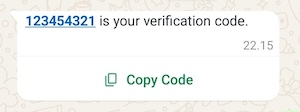
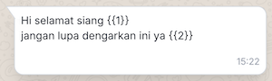
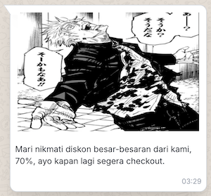
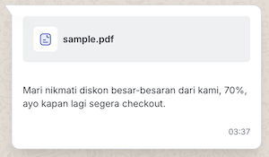
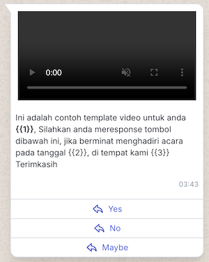
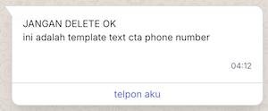

# WhatsApp Outbound Message Direct API

Outbound Message Direct in general sending data to several destination points simultaneously. The delivery is carried out without the need to wait for the readiness of the destination point. The outbound message also does not care whether the message sent is received or not and the message does not require a reply.

| Attributes  | Descriptions |
| ------------- | ------------- |
| Base URL | api.mekari.com |
| Token | HMAC Credentials for Company, create one [here](https://developers.mekari.com/docs/kb/managing-applications/create-application) |
| Plan  | All plans with WhatsApp Channel  |

# Flow

This document will show you how to Send WhatsApp Outbound Message to your customer.


## Authentication

```javascript
const { QontakClient } = require("qontak-client");

const api = new QontakClient({
  clientId: "YOUR_CLIENT_ID",
  clientSecret: "YOUR_CLIENT_SECRET",
});
```

## Get available WhatsApp channels

```javascript
const response = await api.template.getListWhatsappTemplate();
```

Response

```json
{
  "status": "success",
  "data": [ {
      "id": "56b60c3c-0123-46af-958b-32f3ad12ee37",
      "target_channel": "wa_cloud",
      "webhook": "177637332108877",
      "settings": {},
      "organization_id": "a6642f0c-d865-471f-97c7-00adaa313d29",
      "created_at": "2024-01-16T03:35:55.634Z",
      "is_active": true
    }],
  "meta": { "pagination": { "offset": 1, "total": 100, "limit": 100 } }
}
```

## Get available WhatsApp message template

```javascript
const response = await api.template.getListWhatsappTemplate();
```

Response
```json
{
    "status": "success",
    "data": [
      {
        "id": "60cccaa0-ccd9-4efd-bdfb-875859c4b50a",
        "organization_id": "a6642f0c-d865-471f-97c7-00adaa313d29",
        "name": "auth_web_1727242109",
        "language": "en_US",
        "header": null,
        "body": "*{{1}}* is your verification code.",
        "footer": null,
        "buttons": [
            {
                "url": "https://www.whatsapp.com/otp/code/?otp_type=COPY_CODE\u0026code=otp{{1}}",
                "text": "Copy Code",
                "type": "URL",
                "example": "[\"https://www.whatsapp.com/otp/code/?otp_type=COPY_CODE\u0026code=otp123456\"]"
            }
        ],
        "status": "APPROVED",
        "category": "AUTHENTICATION",
        "quality_rating": null,
        "quality_rating_text": "Neutral",
        "type": "campaign",
        "analysis": null,
        "probability": null
      }
    ],
    "meta": {
        "pagination": {
            "cursor": {
                "next": null,
                "prev": null,
                "pit": null
            },
            "offset": 1,
            "limit": 10,
            "total": 53969,
            "target_offset": 0
        }
    }
}
```

## Send Whatsapp Message Outbound Direct

```javascript
async function sendOtp() {
  try {
    const withTextTemplate =         {
      "to_name": "Burhan",
      "to_number": "628117661000",
      "message_template_id": "60cccaa0-ccd9-4efd-bdfb-875859c4b50a",
      "channel_integration_id": "56b60c3c-0123-46af-958b-32f3ad12ee37",
      "language": {
          "code": "id"
      },
      "parameters": {
          "buttons": [
            {
              "index": "0",
              "type": "url",
              "value": "123456"
            }
          ],
          "body": [
              {
                  "key":"1",
                  "value_text":"123454321",
                  "value":"otp"
              }
          ]
      }
    }
    const response = await api.broadcast.createBroadcastDirect(withTextTemplate)
    console.log("Response:", response);
  } catch (error) {
    console.error("Error:", error.response.data);
  }
}
```

## Get Log WhatsApp Outbound Message Direct

```javascript
const response = await api.broadcast.getBroadcastLog(broadcastId);
```

Response
```json
{
  "status": "success",
  "data": [
    {
      "id": "e24e4549-2117-4b12-8c1b-fac105e19960",
      "organization_id": "a6642f0c-d865-471f-97c7-00adaa313d29",
      "messages_broadcast_id": "34879159-8298-486b-8420-f968285d8a42",
      "contact_phone_number": "628117661000",
      "contact_full_name": "Burhan",
      "status": "read",
      "whatsapp_message_id": "wamid.HBgMNjI4MTE3NjYxMDAwFQIAERgSQUQxRjkyOTU1RTkxMTc5OTI2AA==",
      "whatsapp_error_message": "n/a",
      "messages_response": {},
      "messages": {},
      "created_at": "2025-03-24T15:15:31.686Z",
      "is_pacing": false,
      "channel_integration_id": "56b60c3c-0123-46af-958b-32f3ad12ee37"
    }
  ],
  "meta": { "pagination": { "cursor": {}, "offset": 1, "limit": 1, "total": 1 } }
}
```

## Send some of categories of WhatsApp templates

- [Send OTP](#send-otp)
- [Send Text with variable](#send-text-with-variable)
- [Send Image](#send-image)
- [Send Document](#send-document)
- [Send Video](#send-video)
- [Send CTA Button](#send-cta-button)


### Send OTP

Message Template with category Authentication. Furthermore read [here](https://developers.facebook.com/docs/whatsapp/business-management-api/authentication-templates/).



```javascript
const withTextTemplate =         {
  "to_name": "Burhan",
  "to_number": "628117661000",
  "message_template_id": "60cccaa0-ccd9-4efd-bdfb-875859c4b50a",
  "channel_integration_id": "56b60c3c-0123-46af-958b-32f3ad12ee37",
  "language": {
      "code": "id"
  },
  "parameters": {
      "buttons": [
        {
          "index": "0",
          "type": "url",
          "value": "123456"
        }
      ],
      "body": [
          {
              "key":"1",
              "value_text":"123454321",
              "value":"otp"
          }
      ]
  }
}
const response = await api.broadcast.createBroadcastDirect(withTextTemplate)
```

### Send Text with variable

Message template text with variable.



```javascript
const withTextTemplate =         {
  "to_name": "Burhan",
  "to_number": "628117661000",
  "message_template_id": "d3e1083c-66ea-410b-b807-1d84182ffa82",
  "channel_integration_id": "56b60c3c-0123-46af-958b-32f3ad12ee37",
  "language": {
      "code": "id"
  },
  "parameters": {
      "buttons": [],
      "body": [
          {
              "key":"1",
              "value_text":"burhan",
              "value":"name"
          },
          {
            "key":"2",
            "value_text":"lagu nusantara",
            "value":"lagu"
        }
      ]
  }
}
const response = await api.broadcast.createBroadcastDirect(withTextTemplate)
```

### Send Image

Message Template with image attachment.



```javascript
const withImageTemplate = {
  "to_name": "Burhan",
  "to_number": "628117661000",
  "message_template_id": "34d95207-0b48-4ce0-b589-2b7c1519d457",
  "channel_integration_id": "56b60c3c-0123-46af-958b-32f3ad12ee37",
  "language": {
      "code": "id"
  },
  "parameters": {
      "header": {
        "format": "IMAGE",
        "params": [
          {
            "key": "url",
            "value": "https://cdn.qontak.com/uploads/direct/images/d0295a8b-4164-490e-b250-67222f7e6884/Gojo_copy.jpeg"
          },
          {
            "key": "filename",
            "value": "Gojo_copy.jpeg"
          }
        ]
      },
      "buttons": [],
      "body": []
  }
}
const response = await api.broadcast.createBroadcastDirect(withImageTemplate)
```


### Send Document


Message Template with document attachment.



```javascript
const withDocTemplate =         {
  "to_name": "Burhan",
  "to_number": "628117661000",
  "message_template_id": "380d1355-0a65-4dc5-be82-308ee7619910",
  "channel_integration_id": "56b60c3c-0123-46af-958b-32f3ad12ee37",
  "language": {
      "code": "id"
  },
  "parameters": {
      "header": {
        "format": "DOCUMENT",
        "params": [
          {
            "key": "url",
            "value": "https://cdn.qontak.com/uploads/direct/files/e20c3f02-8b23-4c2f-ae4b-3b7ec4f569d9/akdhasidhasjkdhajsdhakjsdhaskjdhakjsdhakjsdhajkshdkjashdaksjdhakjsdahdsak.pdf"
          },
          {
            "key": "filename",
            "value": "sample.pdf"
          }
        ]
      },
      "body": []
  }
}
const response = await api.broadcast.createBroadcastDirect(withDocTemplate)
```


### Send Video

Message Template with video attachment.



```javascript
const withVideoTemplate =     {
  "to_name": "Burhan",
  "to_number": "628117661000",
  "message_template_id": "70332b74-e9bd-4829-bb31-c46924e7d3ff",
  "channel_integration_id": "56b60c3c-0123-46af-958b-32f3ad12ee37",
  "language": {
    "code": "id"
  },
  "parameters": {
    "header": {
      "format": "VIDEO",
      "params": [
        {
          "key": "url",
          "value": "https://cdn.qontak.com/uploads/direct/videos/60564c86-725e-429a-bffb-8168f3daac77/sample_video.mp4"
        },
        {
          "key": "filename",
          "value": "sample_video.mp4"
        }
      ]
    },
    "body": [
      {
        "key": "1",
        "value_text": "Valent",
        "value": "customer_name"
      },
      {
        "key": "2",
        "value_text": "Qontak",
        "value": "company"
      },
      {
        "key": "3",
        "value_text": "Qontak",
        "value": "company"
      }
    ]
  }
}
const response = await api.broadcast.createBroadcastDirect(withVideoTemplate)
```


### Send CTA Button

Message Template with CTA Link URL Button.



```javascript
withCtaURL =         {
  "to_name": "Burhan",
  "to_number": "628117661000",
  "message_template_id": "a36ea83e-1b63-41e9-a91b-bad2390531e9",
  "channel_integration_id": "56b60c3c-0123-46af-958b-32f3ad12ee37",
  "language": {
      "code": "id"
  },
  "parameters": {
      "buttons": [
        {
          "index": "0",
          "type": "URL",
          "value": "fitur/personalisasi-report-sales",
        }
      ],
      "body": []
  }
}
const response = await api.broadcast.createBroadcastDirect(withCtaURL)
```

